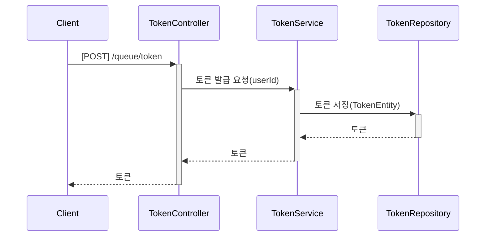
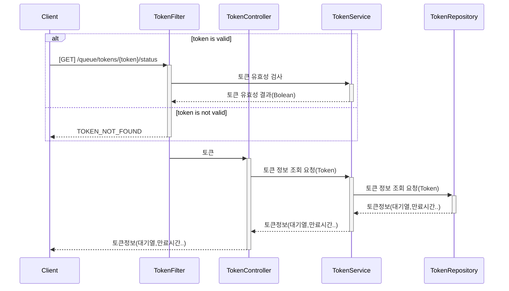
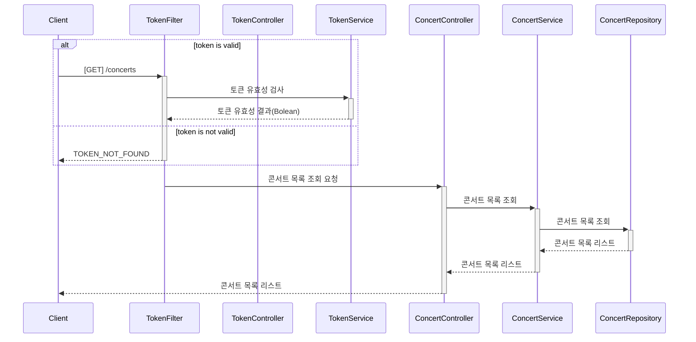
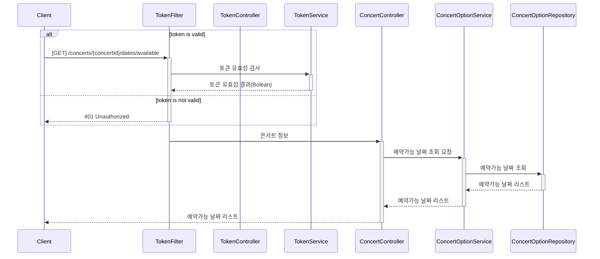
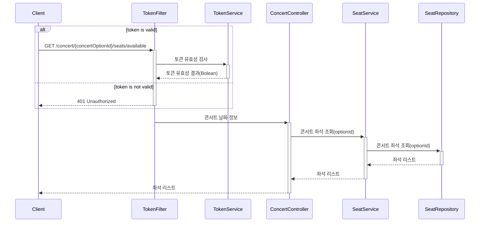
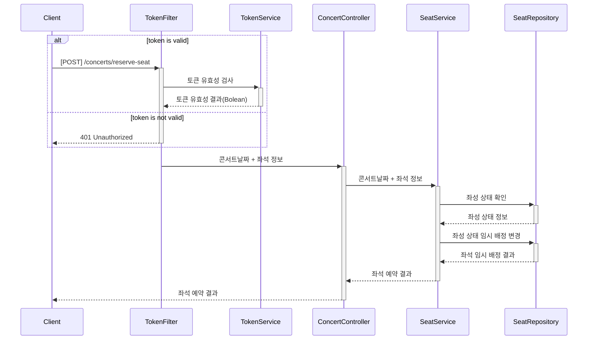
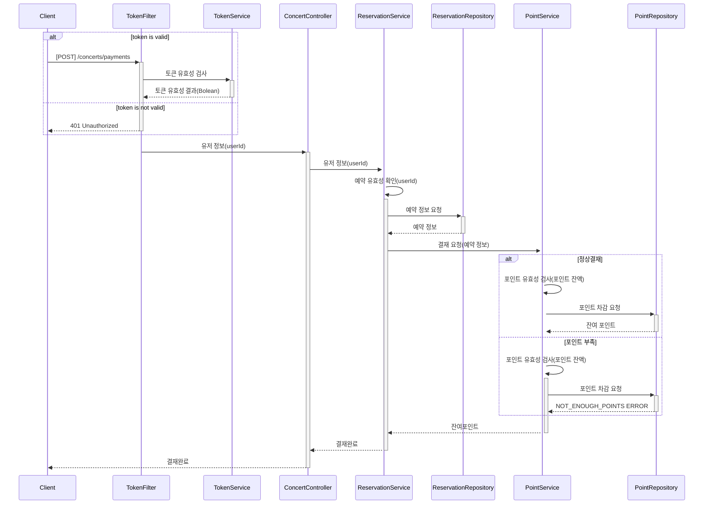
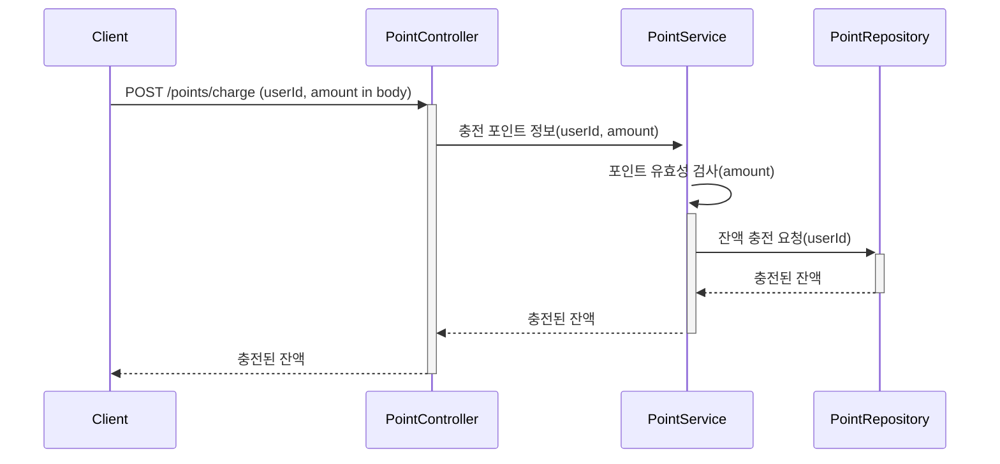
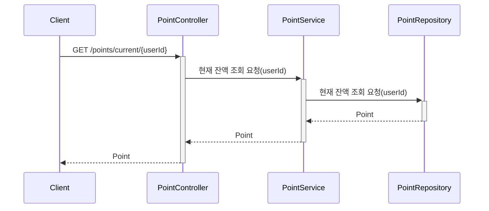
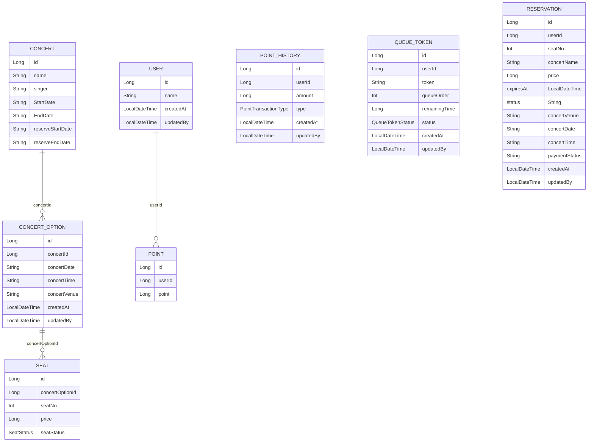

# 콘서트 예약 시스템

## 요구사항

* 유저 토큰 발급 API
  * 예약 가능 날짜 / 좌석 API
  * 좌석 예약 요청 API
  * 잔액 충전 / 조회 API
  * 결제 API
* 각 기능 및 제약사항에 대해 단위 테스트를 반드시 하나 이상 작성하도록 합니다.
* 다수의 인스턴스로 어플리케이션이 동작하더라도 기능에 문제가 없도록 작성하도록 합니다.
* 동시성 이슈를 고려하여 구현합니다.
* 대기열 개념을 고려해 구현합니다.

---

## 마일스톤

* 1주차 : [콘서트 티켓팅 예약 시스템 설계](https://github.com/users/ByeonJuHwan/projects/7/views/4?pane=issue&itemId=69218480) (API 명세, 시퀀스 다이어그램, ERD, 마일스톤 작성, Mock API 작성)
* 2주차 : [포인트 충전 / 조회 기능 구현](https://github.com/users/ByeonJuHwan/projects/7/views/4?pane=issue&itemId=69218504), [대기열 시스템 구현](https://github.com/users/ByeonJuHwan/projects/7/views/4?pane=issue&itemId=69218492)
* 3주차 : [콘서트 좌석 예약](https://github.com/users/ByeonJuHwan/projects/7/views/4?pane=issue&itemId=69218503), [결재 구현](https://github.com/users/ByeonJuHwan/projects/7/views/4?pane=issue&itemId=69218505)


---
## 시퀀스 다이어그램

### 토큰 발급 API


### 토큰 조회 API



### 콘서트 목록 조회 API



### 예약 가능한 날짜 조회 API



### 예약 가능한 좌석 조회 API



### 콘서트 좌석 예약 API




### 결재 API



### 포인트 충전 API



### 포인트 조회 API



---

## API 명세서

### 1. 유저 대기열 토큰 발급

| Method | URI | Description         |
|-----|-----|---------------------|
| POST |/queue/token| 대기열 등록| 

**Request**

```https
  curl -X POST https://{SERVER_URL}/queue/token \
  -H "Content-Type: application/json" \
  -d '{ \
        "userId": "{userId}", \
      }'
```
**Response**

```json
{
    "result": {
        "token": "eyJhbGciOiJIUzI1NiIsInR5cCI6IkpXVCJ9"
    }
}
```

**Error**
```json
{
    "status": "TOKEN_GENERATION_FAILED",
    "message": "토큰 생성에 실패했습니다. 다시 시도해주세요."
}
```

---
### 2. 유저 토큰 정보 조회 API

| Method | URI | Description         |
|-----|-----|---------------------|
| GET |/queue/tokens/{token}/status| 대기열 정보 확인| 

**Request**

```https
curl -X GET https://{SERVER_URL}/queue/token/status?token={token}
```

**Response**

```json
{
    "result": {
        "token": "eyJhbGciOiJIUzI1NiIsInR5cCI6IkpXVCJ9",
        "status": "ACTIVE",
        "queueOrder": 10,
        "remainingTime": 360
    }
}
```

**Error**
```json
{
  "code": "TOKEN_NOT_FOUND",
  "message": "토큰 정보를 찾을 수 없습니다"
}
```

---

### 3. 콘서트 목록 조회 API

| Method | URI | Description         |
|-----|-----|---------------------|
| GET |/concerts|콘서트 목록 조회|

**Request**

```https
curl -X GET https://{SERVER_URL}/concerts\
```

**Response**

```json

{
    "result": {
        "concerts": [
            {
                "concertName": "아이유 콘서트",
                "singer": "아이유",
                "startDate": "2024-02-01",
                "endDate": "2024-02-12",
                "reserveStartDate": "2024-01-01",
                "reserveEndDate": "2024-01-31",
                "id": 1
            },
            {
                "concertName": "에스파 콘서트",
                "singer": "에스파",
                "startDate": "2024-02-01",
                "endDate": "2024-02-12",
                "reserveStartDate": "2024-01-01",
                "reserveEndDate": "2024-01-31",
                "id": 2
            }
        ]
    }
}

```
---

### 4. 예약 가능한 날짜 조회 API

| Method | URI | Description         |
|-----|-----|---------------------|
| GET |/concerts/{concertId}/dates/available |예약 가능한 날짜 조회 | 

**Request**

```https
curl -X GET https://{SERVER_URL}/concerts/{concertId}/dates/available \
  -H "Authorization: Bearer {token}"
```

**Response**

```json
{
    "result": {
        "concerts": [
            {
                "concertId": 1,
                "title": "에스파 콘서트",
                "concertDate": "024-07-15",
                "concertTime": "13:00",
                "concertVenue": "잠실 종합 운동장",
                "availableSeats": 50
            },
            {
                "concertId": 1,
                "title": "에스파 콘서트",
                "concertDate": "024-07-16",
                "concertTime": "18:00",
                "concertVenue": "도쿄돔",
                "availableSeats": 50
            }
        ]
    }
}
```
**Error**

```json
{
  "code": "TOKEN_EXPIRED",
  "message": "토큰이 만료되었습니다"
}
```

---

### 5.예악 가능 좌석 API

| Method | URI | Description         |
|-----|-----|---------------------|
| GET |/concerts/{concertOptionId}/seats/available|예약 가능한 좌석 조회 | 


**Request**

```https
curl -X GET https://{SERVER_URL}/concerts/{concertOptionId}/seats/available \
  -H "Authorization: Bearer {token}"
```

**Response**

```json
{
    "result": {
        "concertOptionId": 1,
        "seats": [
            {
                "seatId": 1,
                "seatNumber": 1,
                "price": 5000
            },
            {
                "seatId": 23,
                "seatNumber": 16,
                "price": 5000
            },
            {
                "seatId": 29,
                "seatNumber": 17,
                "price": 10000
            }
        ]
    }
}
```
**Error**

```json
{
  "code": "TOKEN_EXPIRED",
  "message": "토큰이 만료되었습니다"
}
```

```json
{
  "code": "NO_SEATS_AVAILABLE",
  "message": "예약 가능한 좌석이 없습니다."
}
```

---

### 6. 콘서트 좌석 예약 API

| Method | URI | Description         |
|-----|-----|---------------------|
| POST |/concerts/reserve-seat|콘서트 좌석 예약 | 


**Request**

```https
  curl -X POST https://{SERVER_URL}/concerts/reserve-seat \
  -H "Authorization: Bearer {token}" \
  -d '{ \
        "concertOptionId": {concertOptionId}, \
        "seatNo": {seatNo} 
      }'
```
**Response**

```json
{
    "result": {
        "status": "PENDING",
        "expiresAt": "2024-07-03T23:40:25.775651"
    }
}
```

**Error**

```json
{
  "code": "TOKEN_EXPIRED",
  "message": "토큰이 만료되었습니다"
}
```
```json
{
  "code": "SEAT_NOT_FOUND",
  "message": "존재하지 않는 좌석입니다. 다른 좌석을 선택해주세요"
}
```
```json
{
  "code": "SEAT_ALREADY_RESERVED",
  "message": "이미 예약된 좌석입니다. 다른 좌석을 선택해주세요"
} 
```
---

### 7. 콘서트 좌석 결제 API

| Method | URI | Description         |
|-----|-----|---------------------|
| POST |/concerts/payments|콘서트 좌석 결재 | 


**Request**

```https
  curl -X POST https://{SERVER_URL}/concerts/payments \
  -H "Authorization: Bearer {token}" \
  -d '{ \
        "reservationId": {reservationId} \
      }'
```
**Response**

```json
{
    "reservationId": "1",
    "seatNo": "1",
    "concertVenue" : "서울 잠실 종합운동장",
    "concertDate" : "2025-01-01",
    "concertTime" : "13:00"
}
```
**Error**

```json
{
  "code": "TOKEN_EXPIRED",
  "message": "토큰이 만료되었습니다"
}
```
```json
{
    "status": "PAYMENT_FAILED",
    "message": "결제에 실패했습니다. 다시 시도해주세요."
}
```
```json
{
   "status": "SEAT_ALLOCATION_EXPIRED",
   "message": "좌석 임시 배정 시간이 만료되었습니다. 다시 시도해주세요."
} 
```
```json
{
  "code": "INSUFFICIENT_POINTS",
  "insufficient_point": 3000,
  "point": 2000,
  "message": "포인트 부족"
} 
```

---

### 8. 포인트 충전 API

| Method | URI | Description         |
|-----|-----|---------------------|
| PUT |/points/charge|포인트 충전 | 

**Request**

```https
  curl -X POST https://{SERVER_URL}/points/charge \
  -H "Content-Type: application/json" \
  -d '{ \
        "userId": {userId}, \
        "amount": {amount} \
      }'
```

**Response**

```json
{
    "result": {
        "currentPoints": 5000
    }
}
```
**Error**
```json
{
    "status": "CHARGE_FAILED",
    "message": "포인트 충전에 실패했습니다. 다시 시도해주세요."
}
```

---

### 9. 포인트 조회 API

| Method | URI | Description         |
|-----|-----|---------------------|
| GET |/points/current/{userId} |포인트 조회| 

**Request**

```https
  curl -X GET https://{SERVER_URL}/points/current/{userId}
  -H "Content-Type: application/json"
```

**Response**

```json
{
    "result": {
        "currentPoints": 5000
    }
}
```

---

## ERD

