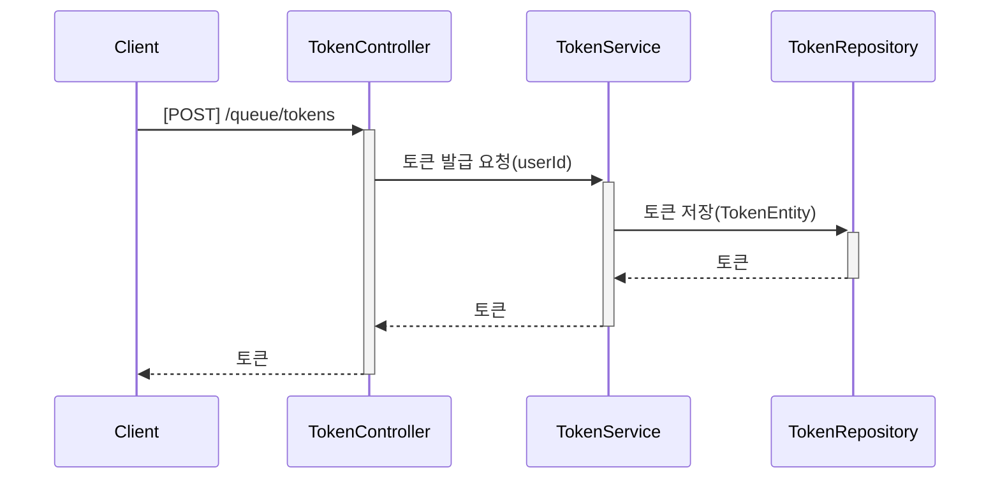
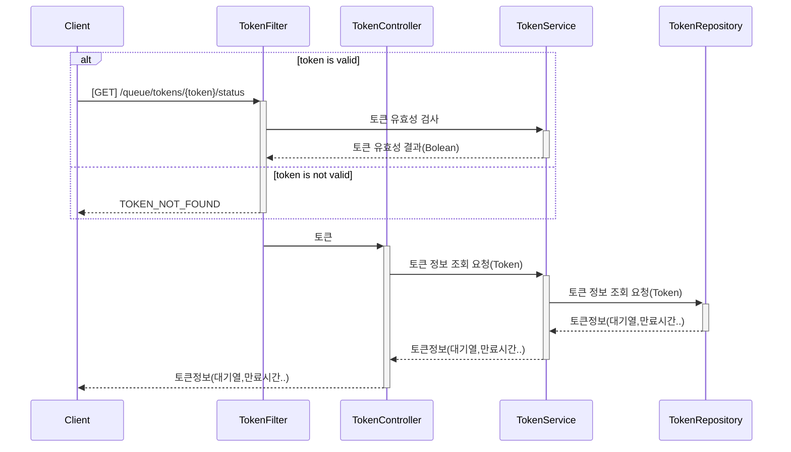
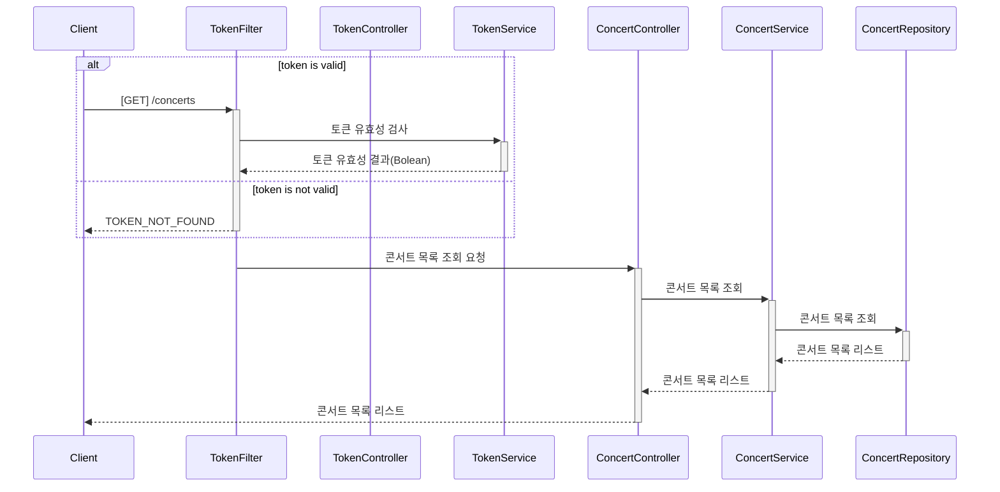
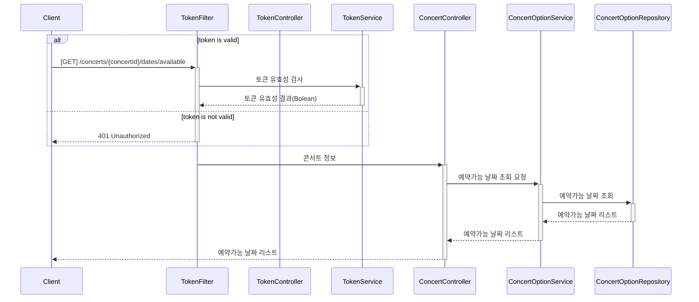
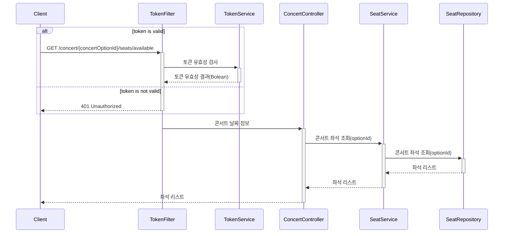
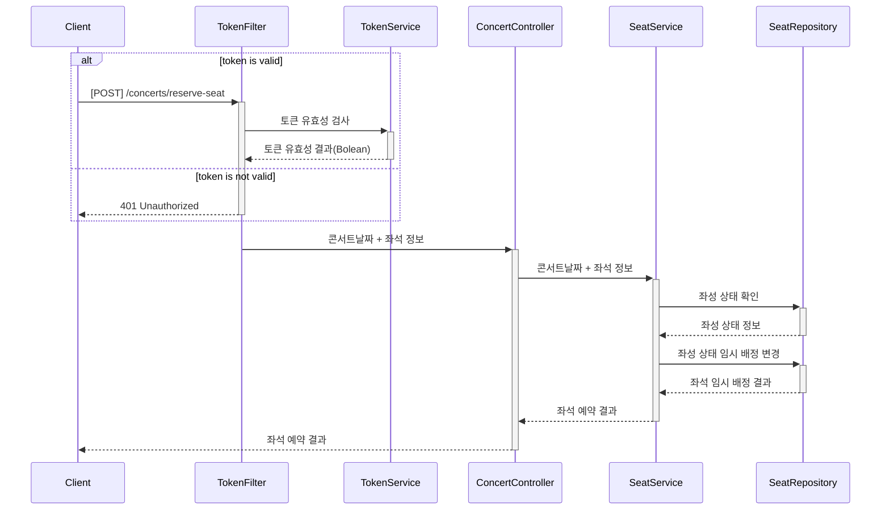
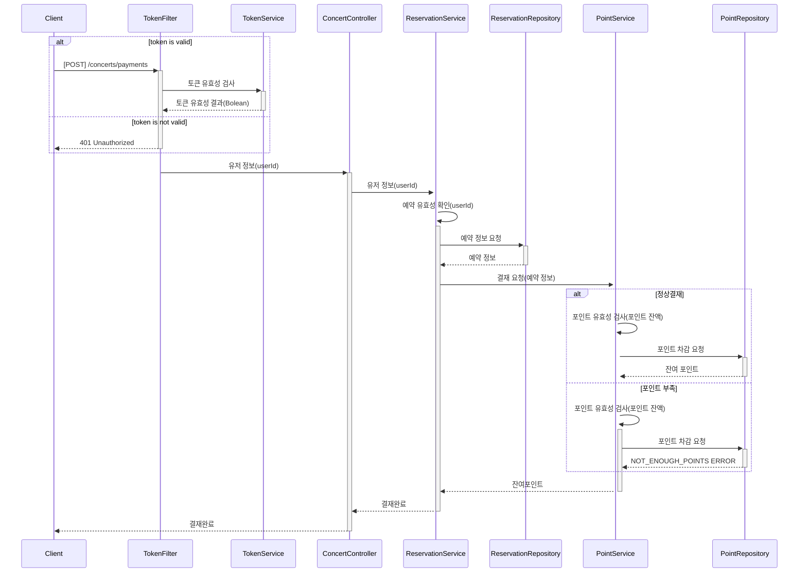
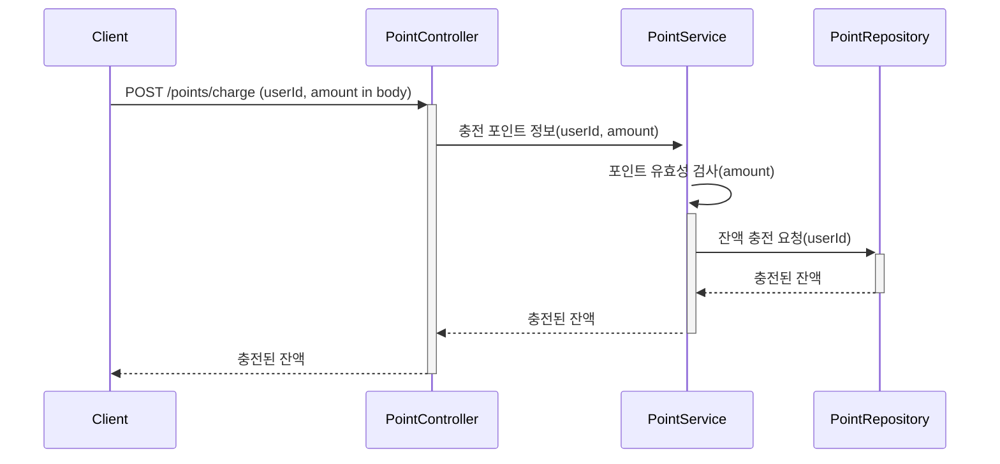
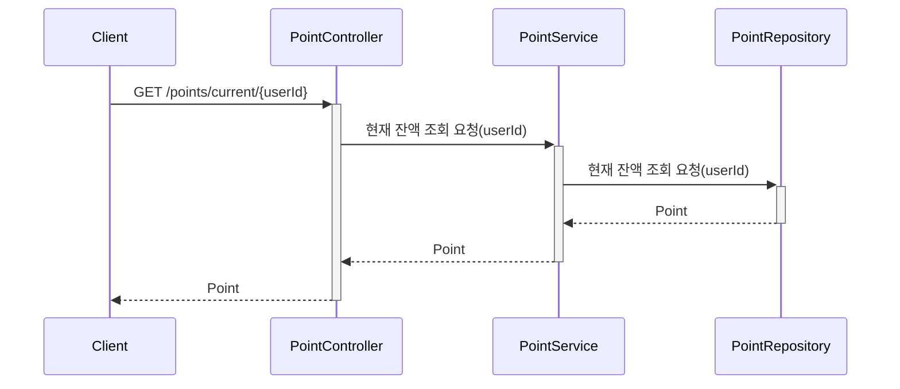
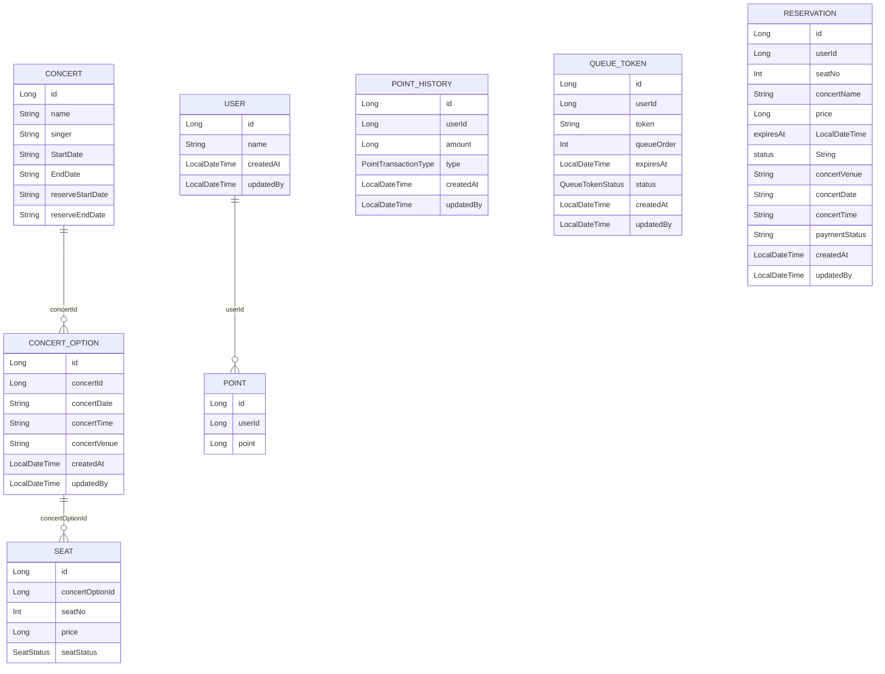

# 콘서트 예약 시스템

## 요구사항

* 유저 토큰 발급 API
  * 예약 가능 날짜 / 좌석 API
  * 좌석 예약 요청 API
  * 잔액 충전 / 조회 API
  * 결제 API
* 각 기능 및 제약사항에 대해 단위 테스트를 반드시 하나 이상 작성하도록 합니다.
* 다수의 인스턴스로 어플리케이션이 동작하더라도 기능에 문제가 없도록 작성하도록 합니다.
* 동시성 이슈를 고려하여 구현합니다.
* 대기열 개념을 고려해 구현합니다.

---

## 마일스톤

* 1주차 : [콘서트 티켓팅 예약 시스템 설계](https://github.com/users/ByeonJuHwan/projects/7/views/4?pane=issue&itemId=69218480) (API 명세, 시퀀스 다이어그램, ERD, 마일스톤 작성, Mock API 작성)
* 2주차 : [포인트 충전 / 조회 기능 구현](https://github.com/users/ByeonJuHwan/projects/7/views/4?pane=issue&itemId=69218504), [대기열 시스템 구현](https://github.com/users/ByeonJuHwan/projects/7/views/4?pane=issue&itemId=69218492)
* 3주차 : [콘서트 좌석 예약](https://github.com/users/ByeonJuHwan/projects/7/views/4?pane=issue&itemId=69218503), [결재 구현](https://github.com/users/ByeonJuHwan/projects/7/views/4?pane=issue&itemId=69218505)


---
## 시퀀스 다이어그램

### 토큰 발급 API


### 토큰 조회 API



### 콘서트 목록 조회 API



### 예약 가능한 날짜 조회 API



### 예약 가능한 좌석 조회 API



### 콘서트 좌석 예약 API




### 결재 API



### 포인트 충전 API



### 포인트 조회 API



---

## API 명세서

### 1. 유저 대기열 토큰 발급

| Method | URI | Description         |
|-----|-----|---------------------|
| POST |/queue/tokens| 대기열 등록| 

**Request**

```https
  curl -X POST https://{SERVER_URL}/queue/tokens \
  -H "Content-Type: application/json" \
  -d '{ \
        "userId": "{userId}", \
      }'
```
**Response**

```json
{
    "result": {
        "token": "eyJhbGciOiJIUzI1NiIsInR5cCI6IkpXVCJ9"
    }
}
```

**Error**
```json
{
    "status": "TOKEN_GENERATION_FAILED",
    "message": "토큰 생성에 실패했습니다. 다시 시도해주세요."
}
```

---
### 2. 유저 토큰 정보 조회 API

| Method | URI | Description         |
|-----|-----|---------------------|
| GET |/queue/tokens/{token}/status| 대기열 정보 확인| 

**Request**

```https
curl -X GET https://{SERVER_URL}/queue/token/status?token={token}
```

**Response**

```json
{
    "result": {
        "token": "eyJhbGciOiJIUzI1NiIsInR5cCI6IkpXVCJ9",
        "status": "ACTIVE",
        "queueOrder": 10,
        "remainingTime": 360
    }
}
```

**Error**
```json
{
  "code": "TOKEN_NOT_FOUND",
  "message": "토큰 정보를 찾을 수 없습니다"
}
```

---

### 3. 콘서트 목록 조회 API

| Method | URI | Description         |
|-----|-----|---------------------|
| GET |/concerts|콘서트 목록 조회|

**Request**

```https
curl -X GET https://{SERVER_URL}/concerts\
```

**Response**

```json

{
    "result": {
        "concerts": [
            {
                "concertName": "아이유 콘서트",
                "singer": "아이유",
                "startDate": "2024-02-01",
                "endDate": "2024-02-12",
                "reserveStartDate": "2024-01-01",
                "reserveEndDate": "2024-01-31",
                "id": 1
            },
            {
                "concertName": "에스파 콘서트",
                "singer": "에스파",
                "startDate": "2024-02-01",
                "endDate": "2024-02-12",
                "reserveStartDate": "2024-01-01",
                "reserveEndDate": "2024-01-31",
                "id": 2
            }
        ]
    }
}

```
---

### 4. 예약 가능한 날짜 조회 API

| Method | URI | Description         |
|-----|-----|---------------------|
| GET |/concerts/{concertId}/available-dates |예약 가능한 날짜 조회 | 

**Request**

```https
curl -X GET https://{SERVER_URL}/concerts/{concertId}/dates/available \
  -H "Authorization: Bearer {token}"
```

**Response**

```json
{
    "result": {
        "concerts": [
            {
                "concertId": 1,
                "title": "에스파 콘서트",
                "concertDate": "024-07-15",
                "concertTime": "13:00",
                "concertVenue": "잠실 종합 운동장",
                "availableSeats": 50
            },
            {
                "concertId": 1,
                "title": "에스파 콘서트",
                "concertDate": "024-07-16",
                "concertTime": "18:00",
                "concertVenue": "도쿄돔",
                "availableSeats": 50
            }
        ]
    }
}
```
**Error**

```json
{
  "code": "TOKEN_EXPIRED",
  "message": "토큰이 만료되었습니다"
}
```

---

### 5.예악 가능 좌석 API

| Method | URI | Description         |
|-----|-----|---------------------|
| GET |/concerts/{concertOptionId}/seats/available|예약 가능한 좌석 조회 | 


**Request**

```https
curl -X GET https://{SERVER_URL}/concerts/{concertOptionId}/seats/available \
  -H "Authorization: Bearer {token}"
```

**Response**

```json
{
    "result": {
        "concertOptionId": 1,
        "seats": [
            {
                "seatId": 1,
                "seatNumber": 1,
                "price": 5000
            },
            {
                "seatId": 23,
                "seatNumber": 16,
                "price": 5000
            },
            {
                "seatId": 29,
                "seatNumber": 17,
                "price": 10000
            }
        ]
    }
}
```
**Error**

```json
{
  "code": "TOKEN_EXPIRED",
  "message": "토큰이 만료되었습니다"
}
```

```json
{
  "code": "NO_SEATS_AVAILABLE",
  "message": "예약 가능한 좌석이 없습니다."
}
```

---

### 6. 콘서트 좌석 예약 API

| Method | URI | Description         |
|-----|-----|---------------------|
| POST |/concerts/reserve-seat|콘서트 좌석 예약 | 


**Request**

```https
  curl -X POST https://{SERVER_URL}/concerts/reserve-seat \
  -H "Authorization: Bearer {token}" \
  -d '{ \
        "concertOptionId": {concertOptionId}, \
        "seatNo": {seatNo} 
      }'
```
**Response**

```json
{
    "result": {
        "status": "PENDING",
        "expiresAt": "2024-07-03T23:40:25.775651"
    }
}
```

**Error**

```json
{
  "code": "TOKEN_EXPIRED",
  "message": "토큰이 만료되었습니다"
}
```
```json
{
  "code": "SEAT_NOT_FOUND",
  "message": "존재하지 않는 좌석입니다. 다른 좌석을 선택해주세요"
}
```
```json
{
  "code": "SEAT_ALREADY_RESERVED",
  "message": "이미 예약된 좌석입니다. 다른 좌석을 선택해주세요"
} 
```
---

### 7. 콘서트 좌석 결제 API

| Method | URI | Description         |
|-----|-----|---------------------|
| POST |/concerts/payments|콘서트 좌석 결재 | 


**Request**

```https
  curl -X POST https://{SERVER_URL}/concerts/payments \
  -H "Authorization: Bearer {token}" \
  -d '{ \
        "reservationId": {reservationId} \
      }'
```
**Response**

```json
{
    "reservationId": "1",
    "seatNo": "1",
    "concertVenue" : "서울 잠실 종합운동장",
    "concertDate" : "2025-01-01",
    "concertTime" : "13:00"
}
```
**Error**

```json
{
  "code": "TOKEN_EXPIRED",
  "message": "토큰이 만료되었습니다"
}
```
```json
{
    "status": "PAYMENT_FAILED",
    "message": "결제에 실패했습니다. 다시 시도해주세요."
}
```
```json
{
   "status": "SEAT_ALLOCATION_EXPIRED",
   "message": "좌석 임시 배정 시간이 만료되었습니다. 다시 시도해주세요."
} 
```
```json
{
  "code": "INSUFFICIENT_POINTS",
  "insufficient_point": 3000,
  "point": 2000,
  "message": "포인트 부족"
} 
```

---

### 8. 포인트 충전 API

| Method | URI | Description         |
|-----|-----|---------------------|
| PUT |/points/charge|포인트 충전 | 

**Request**

```https
  curl -X POST https://{SERVER_URL}/points/charge \
  -H "Content-Type: application/json" \
  -d '{ \
        "userId": {userId}, \
        "amount": {amount} \
      }'
```

**Response**

```json
{
    "result": {
        "currentPoints": 5000
    }
}
```
**Error**
```json
{
    "status": "CHARGE_FAILED",
    "message": "포인트 충전에 실패했습니다. 다시 시도해주세요."
}
```

---

### 9. 포인트 조회 API

| Method | URI | Description         |
|-----|-----|---------------------|
| GET |/points/current/{userId} |포인트 조회| 

**Request**

```https
  curl -X GET https://{SERVER_URL}/points/current/{userId}
  -H "Content-Type: application/json"
```

**Response**

```json
{
    "result": {
        "currentPoints": 5000
    }
}
```

---

## ERD



---

# 동시성 이슈란 ?
간단하게 동시성 이슈란 여러 스레드가 공유자원에 접근하여 값에 대한 조작을 할 때 발생하는 문제입니다.

동시성 이슈를 해결하기 위해서는 크게 아래와 같이 나눌수 있고, 각 방법에 대해서 구현의 복잡도, 성능, 효율성 등을 확인해볼 예정입니다.

* 비관적 락
* 낙관적 락
* 분산락
    *  `Simple Lock` :  key 선점에 의한 lock 획득 실패 시, 비즈니스 로직을 수행하지 않음
    * `Spin Lock` :  lock 획득 실패 시, 일정 시간/횟수 동안 Lock 획득을 재시도
    * `Pub/Sub` : redis pub/sub 구독 기능을 이용해 lock 을 제어

**스프링 부트 3.3.1 + 코틀린 환경에서 진행했고, 콘서트 좌석 예약시 동일 좌석에 여러명이 좌석 예약을 보내는 환경으로 진행했습니다**

---
# 트랜잭션 범위
```
좌석 검색
좌석 검증
좌석 상태변경
예약 생성
```
위 로직 순서대로 로직을 진행한다고 했을때 동일 좌석에 대해서 접근을 하므로 트랜잭션을 좌석으로만 묶을수도 있습니다.
```
-- 락 획득
tx {
  좌석 검색
  좌석 검증
  좌석 상태변경
}
-- 락 반환

tx {
  예약 생성
}
```

락의 범위를 줄이기 위해 트랜잭션의 범위를 줄이는 경우, 상단의 좌석 상태 변경 로직은 정상적으로 실행되어 커밋되었지만, 예약 생성 로직 실행 중 예외가 발생한다면 문제가 생깁니다.

이 경우 좌석 상태 변경을 다시 롤백해주는 별도의 로직(보상 트랜잭션)이 필요합니다. 이러한 보상 트랜잭션을 구현하는 것은 어렵고 관리 포인트가 많아집니다. 따라서 **락 범위를 짧게 하기 위해 트랜잭션의 범위를 줄이는 것만으로는 좋은 해결책이 아닐 수 있습니다.**

따라서 저는 위 4단계의 로직을 하나의 트랜잭션으로 묶어서 예외 발생 시 트랜잭션이 자동으로 롤백을 처리할 수 있도록 했습니다.

---

# 비관적 락

기본적으로 락이라고 하면 두 종류를 떠올릴 수 있습니다
* 공유락(s-lock)
* 배타락(x-lock)

공유락은 select 즉 조회는 가능하지만 update 쓰기 작업은 자신보다 앞선 s-lock 이 다 반환될 때까지 기다립니다.

배타락은 select 즉 조회조차 불가능합니다.

비관적 락은 트랜잭션이 자원을 점유하는 동안 다른 트랜잭션이 해당 자원에 접근하지 못하도록 강제하는 방식으로, 데이터 충돌을 방지하기 위해 자원 접근 시마다 락을 걸어 동시성 이슈를 해결합니다.

간단하게 말하자면 DB 단에서 Lock 을 걸어서 자원의 충돌을 예방하는 방식입니다.

비관적락도 아래와 같이 2가지로 나눌 수 있는데요, 콘서트의 동일 좌석 예약에 따라 어떻게 두 락을 사용하면 되는지 테스트 해 보겠습니다.
1. `PESSIMISTIC_READ` : s-lock
2. `PESSIMISTIC_WRITE` : x-lock

**PESSIMISTIC_READ 구현 방법**
`select ..from.. where ... lock in share mode`
스프링 데이터 JPA 환경에서는 비관적 락을 간단하게 구현이 가능한데 `@Lock(LockModeType.PESSIMISTIC_READ)` 을 붙여주면 구현이 가능합니다.


**성능, 시간 테스트**

10개의 좌석 예약 요청이 들어온다고 하면, s-lock 의 특성상 읽기 작업은 가능하므로 아래 3단계중에서 2단계 까지 가능하고 쓰기작업은 대기합니다.

1. 좌석 조회
2. 좌석 검증 (예약 가능한지)
3. 예약 작업 (쓰기 작업)

```
{조회 ... 검증 ... 예약}
{조회 ... 검증 .......예약}
{조회 ... 검증 ..........예약}
```
이제 실제 10명이 동시에 좌석예약을 하는 테스트를 실행시켜 보면 결과는 아래와 같습니다.
```kotlin
    @Test
    fun `콘서트 좌석 예약 10명 동시성 테스트`() {
        // given
        val seatId = 1L
        val userIds = (1L..10L).toList() // 10명의 사용자 ID 리스트

        // 10개의 예약 요청 생성
        val requests = userIds.map { userId ->
            ConcertReservationDto(
                userId = userId,
                seatId = seatId
            )
        }

        // when
        val startTime = System.currentTimeMillis() // 시간 측정 시작
        requests.map { request ->
            CompletableFuture.runAsync {
                try {
                    concertFacade.reserveSeat(request)
                } catch (e: Exception) {
                    println("예약 실패 : ${request.userId}: ${e.message}")
                }
            }
        }.forEach { it.join() }

        val endTime = System.currentTimeMillis() // 시간 측정 종료

        // 소요 시간 계산
        val elapsedTime = endTime - startTime
        println("소요시간: $elapsedTime ms")

        // then
        val seat = seatRepository.findById(1L)?: throw Exception("seat not found")
        val reservations = reservationRepository.findAll()
        assertThat(seat).isNotNull
        assertThat(seat.seatStatus).isEqualTo(SeatStatus.TEMPORARILY_ASSIGNED)
        assertThat(reservations).hasSize(1)
    }
```


`@Lock(LockModeType.PESSIMISTIC_READ)` 로 동시성 테스트를 해본 결과 데드락이 발생하는 것을 확인 할 수 있습니다.

원인으로는 서로다른 스레드가 동시에 쓰기작업을 하기위해서 락 획득 대기를 하기 때문에 데드락이 발생합니다.

**이로써 이 방법으로는 동시성 문제를 해결 할 수 없기 때문에 다른 방법을 찾아야 합니다.**

---

**PESSIMISTIC_WRITE 구현 방법**

`select ..from.. where ... for update`
스프링 데이터 JPA 환경에서는 비관적 락을 간단하게 구현이 가능한데 `@Lock(LockModeType.PESSIMISTIC_WRITE)` 을 붙여주면 구현이 가능합니다.

어노테이션 하나로 구현이 가능하기 때문에 구현 난이도는 제일 낮습니다.


**성능, 시간 테스트**

`@Lock(LockModeType.PESSIMISTIC_WRITE)` 은 트랜잭션이 들어오면 어떻게 될까요?
위 `@Lock(LockModeType.PESSIMISTIC_READ)` 와 다르게 조회 조차 불가능 하기 때문에 아래와 같이 동작할 것 입니다.

``` 
{조회 ... 검증 ... 예약}
				    {조회 ... 검증 ...예약}
									   {조회 ... 검증 ...예약}
```


콘서트 하나의 좌석에 동시에 10명이 요청을 보냈을때 시간이 얼마나 걸리는지 확인해 보았습니다.

```kotlin
    @Test
    fun `콘서트 좌석 예약 10명 동시성 테스트`() {
        // given
        val seatId = 1L
        val userIds = (1L..10L).toList() // 10명의 사용자 ID 리스트

        // 10개의 예약 요청 생성
        val requests = userIds.map { userId ->
            ConcertReservationDto(
                userId = userId,
                seatId = seatId
            )
        }

        // when
        val startTime = System.currentTimeMillis() // 시간 측정 시작
        requests.map { request ->
            CompletableFuture.runAsync {
                try {
                    concertFacade.reserveSeat(request)
                } catch (e: Exception) {
                    println("예약 실패 : ${request.userId}: ${e.message}")
                }
            }
        }.forEach { it.join() }

        val endTime = System.currentTimeMillis() // 시간 측정 종료

        // 소요 시간 계산
        val elapsedTime = endTime - startTime
        println("소요시간: $elapsedTime ms")

        // then
        val seat = seatRepository.findById(1L)?: throw Exception("seat not found")
        val reservations = reservationRepository.findAll()
        assertThat(seat).isNotNull
        assertThat(seat.seatStatus).isEqualTo(SeatStatus.TEMPORARILY_ASSIGNED)
        assertThat(reservations).hasSize(1)
    }

```

* 10명 테스트 결과 : 소요시간 : 50 ms
* 100명 테스트 결과 : 소요시간: 123 ms

---

# 낙관적 락

낙관적 락은 데이터 충돌을 감지하기 위해 버전 정보를 사용하여, 트랜트랜잭션이 커밋될 때까지 자원에 대한 변경을 허용하는 방식입니다. 충돌이 발생하면 예외를 던지며, 재시도를 통해 문제를 해결할 수 있습니다.

낙관적 락은 DB 단에 락을 거는 방식이 아닌 어플리케이션 단에서 동시성을 관리하므로 성능적인 관점에서 비관적 락보다 유리합니다. 그러나 충돌이 빈번하게 발생하는 경우 재시도 로직 때문에 오히려 성능이 저하될 수 있으므로, 충돌이 잦지 않은 상황에서 사용하는 것이 적합합니다.

**구현 방법**
JPA에서 낙관적 락도 비관적 락처럼 쉽게 구현할 수 있습니다. 낙관적 락은 `@Version` 애노테이션을 통해 엔티티에서 버전 관리를 자동으로 할 수 있습니다. 그러나 비관적 락과 달리, 낙관적 락은 충돌 시 재시도 로직을 구현해야 하므로 상대적으로 구현이 더 어렵습니다.

while 문을 통해 락 획득을 시도하고 3번의 재시도를 합니다.


**성능, 시간 테스트**

```kotlin

    @Test
    fun `콘서트 좌석 예약 10명 동시성 테스트`() {
        // given
        val seatId = 1L
        val userIds = (1L..10L).toList() // 10명의 사용자 ID 리스트

        // 10개의 예약 요청 생성
        val requests = userIds.map { userId ->
            ConcertReservationDto(
                userId = userId,
                seatId = seatId
            )
        }

        // when
        val startTime = System.currentTimeMillis() // 시간 측정 시작
        requests.map { request ->
            CompletableFuture.runAsync {
                try {
                    concertFacade.reserveSeat(request)
                } catch (e: Exception) {
                    println(e.message)
                }
            }
        }.forEach { it.join() }

        val endTime = System.currentTimeMillis() // 시간 측정 종료

        // 소요 시간 계산
        val elapsedTime = endTime - startTime
        println("Elapsed time: $elapsedTime ms")

        // then
        val seat = seatRepository.findById(1L)?: throw Exception("seat not found")
        val reservations = reservationRepository.findAll()
        assertThat(seat).isNotNull
        assertThat(seat.seatStatus).isEqualTo(SeatStatus.TEMPORARILY_ASSIGNED)
        assertThat(reservations).hasSize(1)
    }
```

* 10 명 테스트 결과 : 소요시간 150 ms
* 100 명 테스트 결과 : 소요시간 244 ms

---

# 분산락

분산 락은 여러 애플리케이션 인스턴스가 동시에 자원에 접근할 때 데이터 일관성을 보장하기 위해 사용되며, 주로 Redis와 같은 외부 시스템을 통해 구현됩니다. 이는 분산 환경에서의 동시성 문제를 해결하는 데 효과적이지만, 설정과 관리가 복잡할 수 있습니다.

**구현 방법**
주로 Redis를 사용하므로 도커를 통해 Redis를 띄워 애플리케이션과 연결합니다. 분산 락의 경우 락을 획득하고 반환하는 과정이 필요하며, `락 획득 -> 트랜잭션 -> 로직 -> 커밋 -> 락 반환` 의 순서를 지켜야 합니다. 따라서 구현 방법은 비관적 락이나 낙관적 락보다 어렵습니다.

## Simple Lock
Simple Lock은 Redis에서 키를 선점하여 락을 획득하고, 실패 시 비즈니스 로직을 수행하지 않는 방식입니다. 락 획득 실패 시 예외를 던지며, 재시도 로직을 고려해야 합니다. 실패 빈도가 높은 요청의 경우 주의가 필요합니다.
```kotlin
락 획득 여부 = redis 에서 key 로 확인
if (락 획득) {
	try {
	  로직 실행
	} finally {
	  lock 제거
	}
} 
else {
  throw Lock 획득 실패 예외
}
```

**구현 코드**

락을 획득하고, 해제해주는 Manager 객체를 만든다음에 락을 걸어야하는 로직 앞뒤로 락 관련 로직을 붙여줍니다.


이 Simple Lock의 경우는 락을 획득하기 위한 재시도 로직이 없기 때문에, 만약 락 획득에 실패하면 제일 아래줄의 락 획득 실패 에러가 발생합니다. 따라서 충돌이 자주 일어나는 로직에 적용하면 비즈니스 로직상 에러가 빈번하게 발생할 우려가 있습니다.

**성능, 시간 테스트**

```kotlin
    @Test
    fun `콘서트 좌석 예약 10명 동시성 테스트`() {
        // given
        val seatId = 1L
        val userIds = (1L..10L).toList() // 10명의 사용자 ID 리스트

        // 10개의 예약 요청 생성
        val requests = userIds.map { userId ->
            ConcertReservationDto(
                userId = userId,
                seatId = seatId
            )
        }

        // when
        val startTime = System.currentTimeMillis() // 시간 측정 시작
        requests.map { request ->
            CompletableFuture.runAsync {
                try {
                    concertFacade.reserveSeat(request)
                } catch (e: Exception) {
                    println(e.message)
                }
            }
        }.forEach { it.join() }

        val endTime = System.currentTimeMillis() // 시간 측정 종료

        // 소요 시간 계산
        val elapsedTime = endTime - startTime
        println("Elapsed time: $elapsedTime ms")

        // then
        val seat = seatRepository.findById(1L)?: throw Exception("seat not found")
        val reservations = reservationRepository.findAll()
        assertThat(seat).isNotNull
        assertThat(seat.seatStatus).isEqualTo(SeatStatus.TEMPORARILY_ASSIGNED)
        assertThat(reservations).hasSize(1)
    }
```

* 10명 테스트 소요시간 : 222 ms
* 100명 테스트 소요시간 : 273 ms

테스트가 성공은 한다. 의도대로 좌석 상태가 임시예약으로 변경되고, 예약정보가 생성됩니다.

하지만, Simple Lock 의 특성상 2개 이상의 요청이 들어오면 정상적으로 락을 획득한 요청을 제외한 나머지 로직은 예외가 발생되어 비즈니스 로직이 실행 되지 않습니다. 따라서 이때 필요한게 재시도 로직이 들어간 Spin Lock 이 필요한 것 같습니다.


## Spin Lock
위에서 구현한 재시도 로직이 없는 Simple Lock에서, 이제는 재시도 로직을 통해 락 획득을 계속 시도하며, 예외가 아닌 비즈니스 로직이 실행되도록 구현하면 `spin Lock`방식이 됩니다.

`Spin Lock`은 결국 1개 이상의 스레드가 락 획득을 위해 while 문을 돌고 있으므로, 낙관적 락과 마찬가지로 순서는 보장하지 않습니다.

콘서트 좌석 예약의 경우, 먼저 좌석 예약 요청을 보낸 회원부터 순서대로 요청을 처리해야 하므로, 아직까지는 분산락보다는 비관적 락을 사용하여 순서를 보장하는 것이 좋다고 생각합니다.

**구현 코드 **


재시도 횟수는 3번이며, 락 획득을 재시도하기 위해 스레드는 0.1초 동안 sleep 후 다시 락 획득을 시도하게 구현했습니다. `Simple Lock`에 재시도 로직을 추가하여 구현하는 데 있어서는 좀 더 복잡했습니다.

**성능, 시간 테스트**

**테스트 코드는 위 Simple Lock 과 동일합니다**

100개의 요청이 들어와서 대부분의 스레드가 재시도 로직을 실행하다보니 소요시간이 생각보다 오래 걸렸습니다.

* 10명 테슽 결과 : 소요시간 425 ms
* 100명 테스트 결과 : 소요시간 866 ms

## Pub/Sub

레디스 설정 요소 중 Lettuce가 있는 반면, Redisson을 사용하면 락을 더욱 쉽게 구현할 수 있습니다. Redisson에는 자체적으로 락에 대한 메소드가 이미 구현되어 있기 때문입니다.

Redisson은 내부적으로 Redis의 SETNX 명령어와 Pub/Sub 메커니즘을 사용합니다. 락을 해제할 때, 락 획득을 위해 대기하고 있는 스레드들에게 락 해제 이벤트를 통지하여 대기 중인 스레드가 락을 획득할 수 있도록 합니다.

**구현 방법**

보통 Spring Initializr 를 통해서 Redis 의존성을 주입하면 안되고 Redisson 을 사용하려면 Redisson 의존성을 추가해야합니다.

```kotlin
// redis
implementation("org.redisson:redisson-spring-boot-starter:3.33.0")
```

이제는 락 확득, 락 반환 로직은 Redisson에게 맡기고 사용하면 됩니다.


확실히 락관련 로직도 엄청 짧아집니다.


3초동안 락 획득을 시도하고, 락 획득후 3초동안 락을 유지합니다. 3초후에는 락은 자동으로 해제됩니다.

**성능 및 시간 테스트**
테스트코드는 위 다른 분산락 테스트와 동일합니다

* 10명 테스트 결과 : 소요시간 85 ms
* 100명 테스트 결과 : 소요시간 460 ms


재시도 로직이 없이 락 획득을 대기하고 락을 획득하다보니 일정시간을 두고 재시도를 지속하는 소요시간이 확실히 다른 분산락 보다는 소요시간이 확실히 짧았습니다.

---

# 결론
5가지 방법으로 락을 구현해 본 결과, 10개, 100개 의 요청 기준으로는 비관적 락이 시간이 제일 짧았습니다.

낙관적 락 혹은 재시도 로직이 필요한 분산 락의 경우, 충돌이 빈번하지 않은 상황에서 성능적인 이점을 챙길 수 있었습니다. 반대로, 충돌이 빈번하게 일어나는 경우에는 비관적 락을 사용하는 것이 성능 면에서 더 나은 선택임을 이번 테스트를 통해 확인할 수 있었습니다.

분산락의 경우 장점이 많지만 반대로 사용하기 어려운 상황이 있습니다.
예를 들면, 상품 ID 에 따른 재고 감소 비즈니스 로직있다고 가정합니다.
```
상품 ID -> 아래 상품 아이디의 재고를 차감한다고 가정
TX1 {1,3}
TX2 {3,1}
```

1. 데드락 이슈
   당연하겠지만 서로다른 스레드가 1,3 / 3,1 에 대한 락 획득을 대기 하므로 데드락 이슈가 발생합니다.
2. 키값 을 정하기 어렵다
   TX1 이 실행되는 동안 TX2 가 실행되지 못하게 키값 설정 자체가 불가능합니다. TX1 과 TX2 를 분리     하는 고유한 키 값의 정의가 애매합니다.

물론 상품 ID 하나하나로 키값을 쪼개서 별도의 트랜잭션으로 재고 처리를 한다면 가능은 합니다. 하지만 이때는 비관적 락으로 하는 방법도 생각해 볼 수 있습니다.

위 경우 때문에 분산락을 사용하지 못하는 비즈니스 로직이 존재하기 때문에 적절하게 요구사항과 상황에 맞게 락을 선택해서 사용해야합니다.