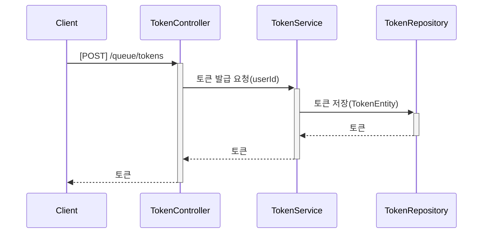
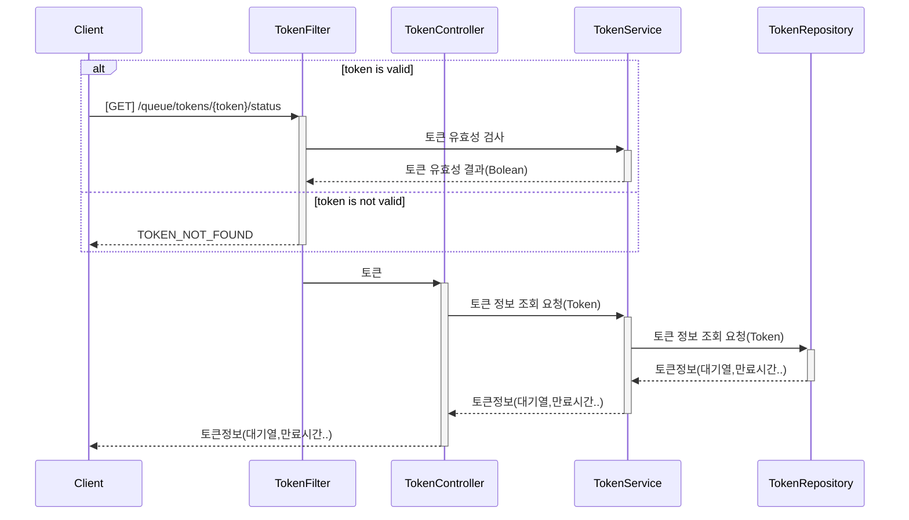
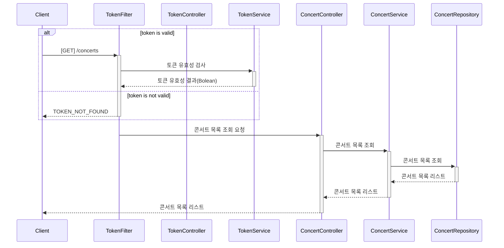
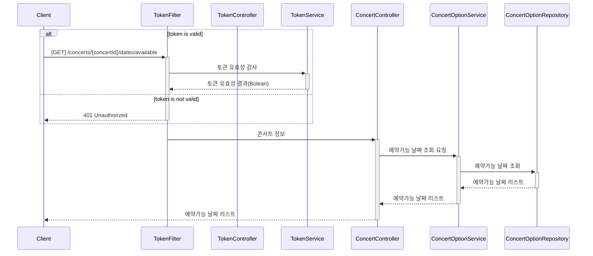
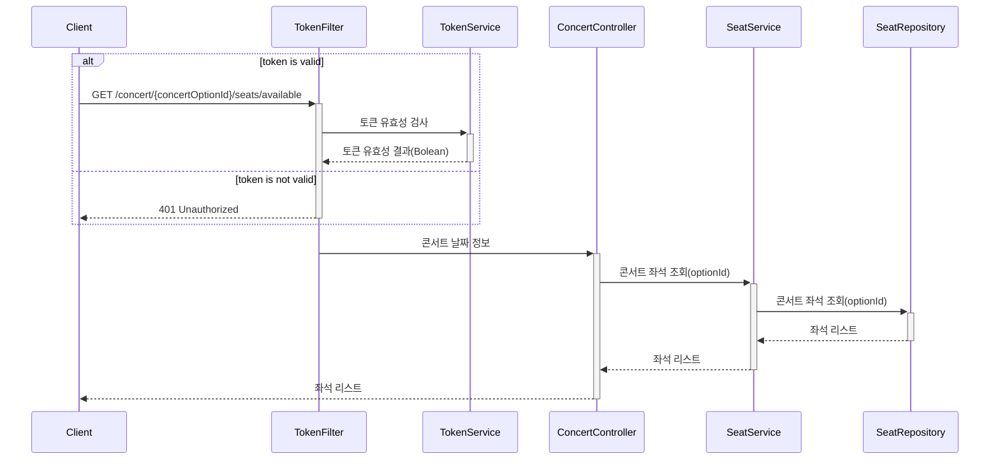
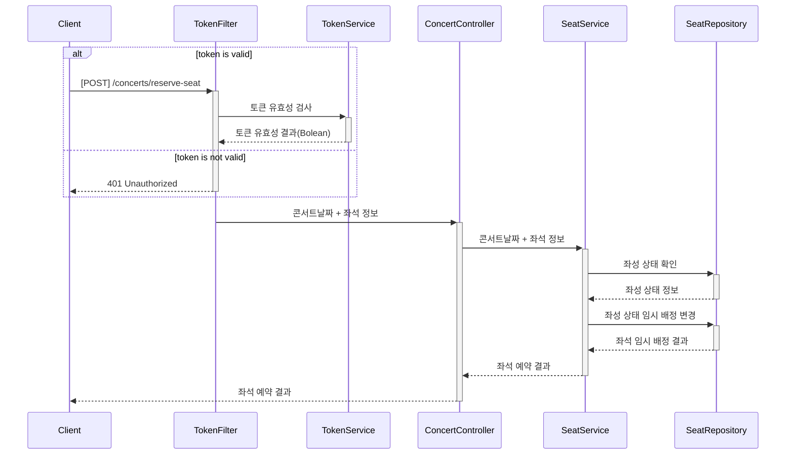
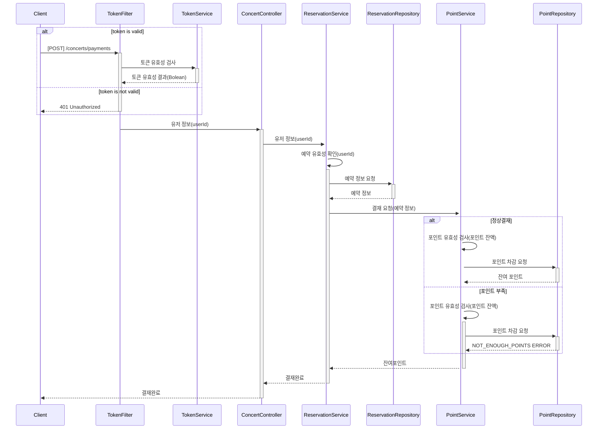
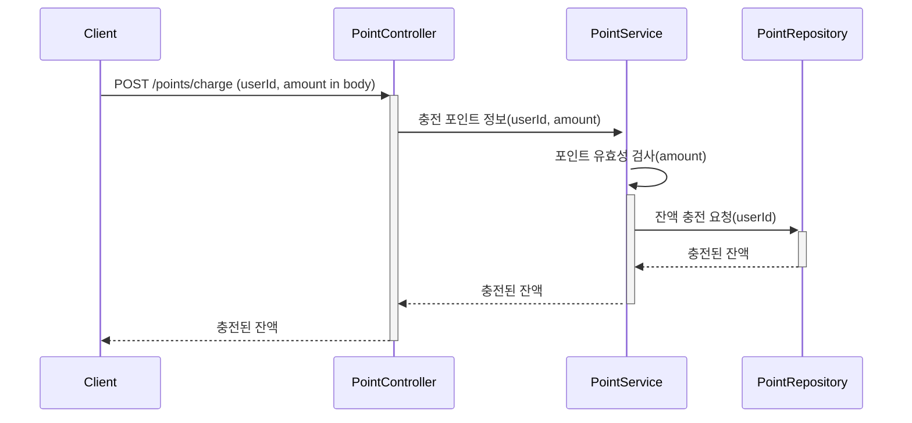
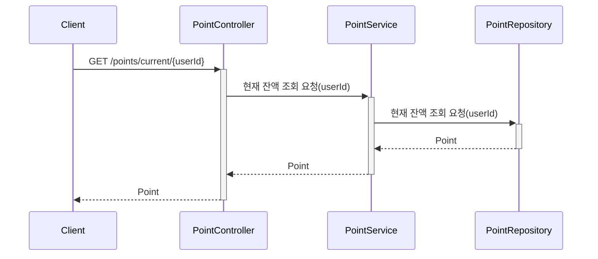
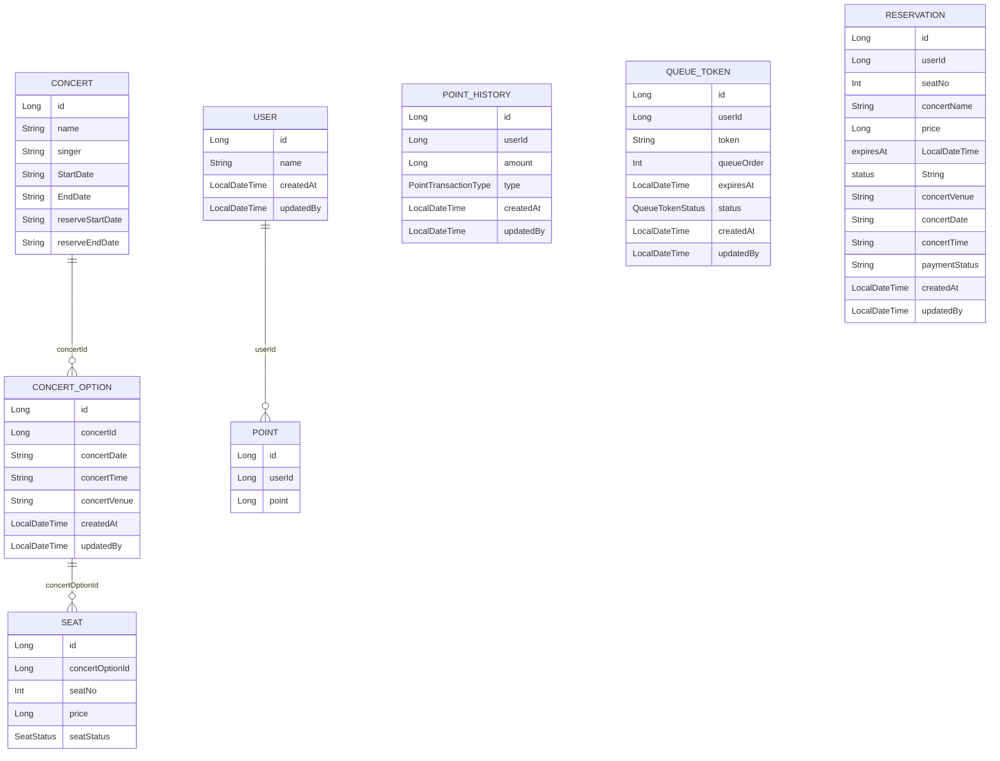

# 콘서트 예약 시스템

## 요구사항

* 유저 토큰 발급 API
  * 예약 가능 날짜 / 좌석 API
  * 좌석 예약 요청 API
  * 잔액 충전 / 조회 API
  * 결제 API
* 각 기능 및 제약사항에 대해 단위 테스트를 반드시 하나 이상 작성하도록 합니다.
* 다수의 인스턴스로 어플리케이션이 동작하더라도 기능에 문제가 없도록 작성하도록 합니다.
* 동시성 이슈를 고려하여 구현합니다.
* 대기열 개념을 고려해 구현합니다.

---

## 마일스톤

* 1주차 : [콘서트 티켓팅 예약 시스템 설계](https://github.com/users/ByeonJuHwan/projects/7/views/4?pane=issue&itemId=69218480) (API 명세, 시퀀스 다이어그램, ERD, 마일스톤 작성, Mock API 작성)
* 2주차 : [포인트 충전 / 조회 기능 구현](https://github.com/users/ByeonJuHwan/projects/7/views/4?pane=issue&itemId=69218504), [대기열 시스템 구현](https://github.com/users/ByeonJuHwan/projects/7/views/4?pane=issue&itemId=69218492)
* 3주차 : [콘서트 좌석 예약](https://github.com/users/ByeonJuHwan/projects/7/views/4?pane=issue&itemId=69218503), [결재 구현](https://github.com/users/ByeonJuHwan/projects/7/views/4?pane=issue&itemId=69218505)

---
## 시퀀스 다이어그램

### 토큰 발급 API

### 토큰 조회 API

### 콘서트 목록 조회 API

### 예약 가능한 날짜 조회 API

### 예약 가능한 좌석 조회 API

### 콘서트 좌석 예약 API

### 결재 API

### 포인트 충전 API

### 포인트 조회 API

---

## API 명세서

[콘서트 좌석 예약 API 명세서 페이지](https://github.com/ByeonJuHwan/Concert-Ticketing/wiki/%EC%BD%98%EC%84%9C%ED%8A%B8-%EC%98%88%EC%95%BD-%EC%84%9C%EB%B9%84%EC%8A%A4-API-%EB%AA%85%EC%84%B8%EC%84%9C)

---

## ERD

---

# 동시성 이슈

콘서트 좌서 예약시 동일한 좌석에 여려명이 예약을 시도하는 과정에서 동시성 이슈가 발생합니다.

어떻게 동시성 이슈를 해결하는지 그리고 락의 범위를 줄이기위해 트랜잭션의 범위를 줄이면 발행하는 사이드 이펙트에 대해서도 작성했습니다.

**[콘서트 좌석 예약의 동시성 이슈 해결 방안](docs/synchronicity.md)**

---

# 인덱스와 캐싱

대용량 트래픽 발생시 데이터의 쓰기 작업보다는 읽기 작업에서 성능 저하가 발생합니다.
읽기 작업을 개선하기 위해서는 아래와 같은 2 가지 방법이 대표적입니다.

- 인덱스
- 캐싱

데이터 베이스를 풀스캔 하지 않고 `Index` 를 활용해서 쿼리 조회 속도를 줄이고, 조회 API 에서 `Index`를 적용하여 어떻게 성능 개선이 되었는지 정리했습니다.

**[콘서트 좌석 예약의 Index 활용 방법 및 성능개선](docs/index.md)**

캐싱의 경우 데이터베이스에서 조회 쿼리를 하지 않기 때문에 빠른 응답이 가능하지만 변동이 잦은 데이터의 경우 데이터 정합성의 문제점이 있습니다.
따라서 어떤 조회 API 에 캐싱을 사용해야 하는지 분석하고, 캐싱 적용 전 후 의 성능 비교를 작성한 문서입니다.

**[콘서트 좌석 예약의 캐싱 활용 방법 및 성능개선](docs/caching.md)**

---

# 이벤트 드리븐 방식 전환 / 아웃박스 패턴

서비스의 규모가 커졌을 경우 각 서비스를 쪼개는 MSA 방식을 사용합니다. 

하나의 서비스에서 이벤트를 발행하고 이벤트를 수신받은
서비스에서 다음 동작을 실행하는 이벤트 드리븐 방식을 적용해보고, `ApplicationEventPublisher` 를 사용해본 뒤 `Kafka` 로 변경하며 겪은 내용을 문서로 정리해 봤습니다.

**[콘서트 좌석 예약의 이벤트 드리븐 방식 적용](docs/event.md)**

이벤트 드리븐 방식을 사용하다보면 네트웨크 문제 혹은 MQ 가 문제가 생겨 이벤트가 정상적으로 발행이 안되는 경우가 생길수 있습니다.

이 문제점을 해결하기 위해 아웃박스 패턴을 사용해서 미발행된 이벤트들을 모아놓고 배치, 스케줄러로 이벤트 발행을 보장해 주는 패턴을 적용해봤습니다.

**[콘서트 좌석 예약의 아웃박스 패턴 적용](docs/outbox.md)**

---

# 부하테스트 / 장애대응

콘서트 좌석 예약이라는 특성상 특정 시간에 급격하게 트래픽이 증가하는 구조를가지고 있습니다.

이를 대비하여 대기열 시스템을 만들었지만, 운영 배포 환경에서는 실제로 몇명의 사용자를 서버가 받을수 있을지 확인이 필요합니다.

이를 위해 부하테스트를 진행하였고 실제로 각 API 가 대량 몇 명의 동시 사용자를 받아 낼 수 있는지 테스트 해봤습니다.

**[콘서트 좌석 예약의 부하테스트](docs/performance.md)**

**[콘서트 좌석 예약의 장애대응문서](docs/response.md)**
