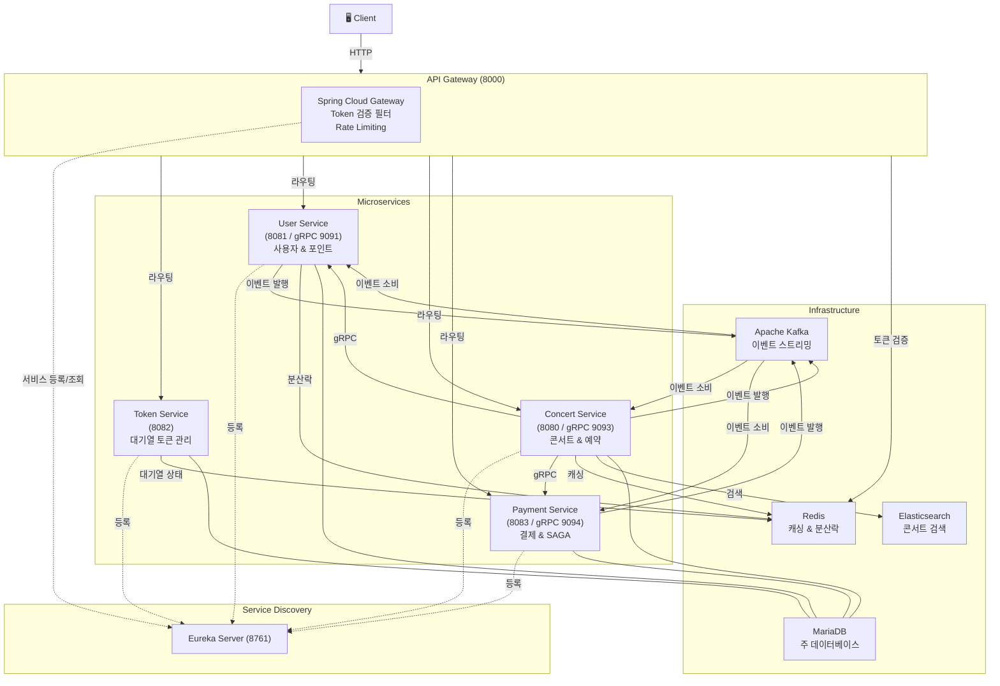
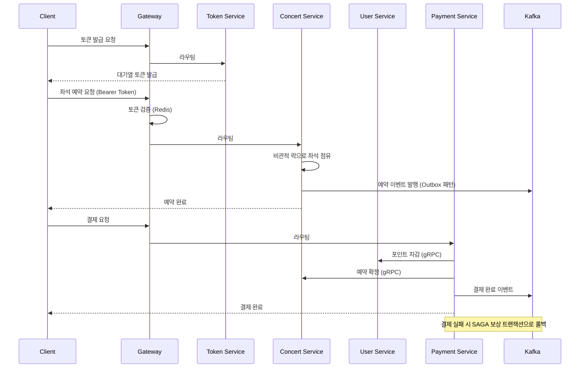

# 콘서트 예약 시스템

## 🎯 주요 성능 지표 (K6 부하 테스트 기준)

| API | 평균 응답시간 | p95 응답시간 | 처리량(TPS) | 최대 동시 사용자 |
|-----|------------|------------|------------|--------------|
| 포인트 충전 | 925ms | 1.74ms | **620** | 1,000명 |
| 포인트 조회 | 887ms | 2.79s | 649 | 6,000명 |
| 토큰 발급 | 4.04ms | 12.68ms | - | 1,800명 (CPU 60%) |
| 콘서트 목록 조회 | 3.77ms | 6.64ms | 420 | 6,000명 |
| 좌석 조회 (캐싱 후) | **4.7ms** | 6.76ms | 487 | 4,000명 |
| 좌석 예약 | 4.49ms | 10.1ms | **645** | 4,000명 |
| 결제 | - | - | - | 1,000명 (정합성 100%) |

> 캐싱 적용으로 좌석 조회 응답시간 **53.2% 개선** (10.05ms → 4.7ms), p95 **76.9% 개선** (29.3ms → 6.76ms)

---

## 🏛️ 시스템 아키텍처


```mermaid
graph TB
    Client["🖥️ Client"]

    subgraph Gateway["API Gateway (8000)"]
        GW["Spring Cloud Gateway<br/>Token 검증 필터<br/>Rate Limiting"]
    end

    subgraph Discovery["Service Discovery"]
        Eureka["Eureka Server (8761)"]
    end

    subgraph Services["Microservices"]
        TS["Token Service<br/>(8082)<br/>대기열 토큰 관리"]
        US["User Service<br/>(8081 / gRPC 9091)<br/>사용자 & 포인트"]
        CS["Concert Service<br/>(8080 / gRPC 9093)<br/>콘서트 & 예약"]
        PS["Payment Service<br/>(8083 / gRPC 9094)<br/>결제 & SAGA"]
    end

    subgraph Infra["Infrastructure"]
        Kafka["Apache Kafka<br/>이벤트 스트리밍"]
        Redis["Redis<br/>캐싱 & 분산락"]
        ES["Elasticsearch<br/>콘서트 검색"]
        DB["MariaDB<br/>주 데이터베이스"]
    end

    Client -->|"HTTP"| Gateway
    Gateway -->|"라우팅"| TS
    Gateway -->|"라우팅"| US
    Gateway -->|"라우팅"| CS
    Gateway -->|"라우팅"| PS

    GW -.->|"서비스 등록/조회"| Eureka
    TS -.->|"등록"| Eureka
    US -.->|"등록"| Eureka
    CS -.->|"등록"| Eureka
    PS -.->|"등록"| Eureka

    CS -->|"gRPC"| US
    CS -->|"gRPC"| PS

    CS -->|"이벤트 발행"| Kafka
    US -->|"이벤트 발행"| Kafka
    PS -->|"이벤트 발행"| Kafka
    Kafka -->|"이벤트 소비"| CS
    Kafka -->|"이벤트 소비"| US
    Kafka -->|"이벤트 소비"| PS

    TS -->|"대기열 상태"| Redis
    CS -->|"캐싱"| Redis
    US -->|"분산락"| Redis
    Gateway -->|"토큰 검증"| Redis

    CS -->|"검색"| ES
    CS --- DB
    US --- DB
    PS --- DB
    TS --- DB
```

### 핵심 요청 흐름 (좌석 예약 → 결제)


```mermaid
sequenceDiagram
    participant C as Client
    participant G as Gateway
    participant T as Token Service
    participant CS as Concert Service
    participant US as User Service
    participant PS as Payment Service
    participant K as Kafka

    C->>G: 토큰 발급 요청
    G->>T: 라우팅
    T-->>C: 대기열 토큰 발급

    C->>G: 좌석 예약 요청 (Bearer Token)
    G->>G: 토큰 검증 (Redis)
    G->>CS: 라우팅
    CS->>CS: 비관적 락으로 좌석 점유
    CS->>K: 예약 이벤트 발행 (Outbox 패턴)
    CS-->>C: 예약 완료

    C->>G: 결제 요청
    G->>PS: 라우팅
    PS->>US: 포인트 차감 (gRPC)
    PS->>CS: 예약 확정 (gRPC)
    PS->>K: 결제 완료 이벤트
    PS-->>C: 결제 완료

    Note over PS,K: 결제 실패 시 SAGA 보상 트랜잭션으로 롤백
```

---

## 📋 프로젝트 개요

### 요구사항
* 유저 토큰 발급 API
* 예약 가능 날짜 / 좌석 API
* 좌석 예약 요청 API
* 잔액 충전 / 조회 API
* 결제 API
* 각 기능 및 제약사항에 대해 단위 테스트를 반드시 하나 이상 작성
* 다수의 인스턴스로 어플리케이션이 동작하더라도 기능에 문제가 없도록 작성
* 동시성 이슈를 고려하여 구현
* 대기열 개념을 고려해 구현

[//]: # (### 마일스톤)

[//]: # (* 1주차: [콘서트 티켓팅 예약 시스템 설계]&#40;https://github.com/users/ByeonJuHwan/projects/7/views/4?pane=issue&itemId=69218480&#41; &#40;API 명세, 시퀀스 다이어그램, ERD, 마일스톤 작성, Mock API 작성&#41;)

[//]: # (* 2주차: [포인트 충전 / 조회 기능 구현]&#40;https://github.com/users/ByeonJuHwan/projects/7/views/4?pane=issue&itemId=69218504&#41;, [대기열 시스템 구현]&#40;https://github.com/users/ByeonJuHwan/projects/7/views/4?pane=issue&itemId=69218492&#41;)

[//]: # (* 3주차: [콘서트 좌석 예약]&#40;https://github.com/users/ByeonJuHwan/projects/7/views/4?pane=issue&itemId=69218503&#41;, [결제 구현]&#40;https://github.com/users/ByeonJuHwan/projects/7/views/4?pane=issue&itemId=69218505&#41;)

[//]: # ()
[//]: # (### 설계 문서)

[//]: # (* [API 명세서]&#40;https://github.com/ByeonJuHwan/Concert-Ticketing/wiki/%EC%BD%98%EC%84%9C%ED%8A%B8-%EC%98%88%EC%95%BD-%EC%84%9C%EB%B9%84%EC%8A%A4-API-%EB%AA%85%EC%84%B8%EC%84%9C&#41;)

[//]: # (* [시퀀스 다이어그램]&#40;https://github.com/ByeonJuHwan/Concert-Ticketing/wiki/%EC%BD%98%EC%84%9C%ED%8A%B8-%EC%A2%8C%EC%84%9D-%EC%98%88%EC%95%BD-%ED%94%84%EB%A1%9C%EC%A0%9D%ED%8A%B8-%EC%8B%9C%ED%80%80%EC%8A%A4-%EB%8B%A4%EC%9D%B4%EC%96%B4%EA%B7%B8%EB%9E%A8&#41;)

[//]: # (* [ERD]&#40;https://github.com/ByeonJuHwan/Concert-Ticketing/wiki/%EC%BD%98%EC%84%9C%ED%8A%B8-%EC%A2%8C%EC%84%9D-%EC%98%88%EC%95%BD-ERD&#41;)

## 📂 프로젝트 구조
```
Concert-Ticketing/
├── concert-service/      # 콘서트 관리 & 예약 (HTTP:8080, gRPC:9093)
├── payment-service/      # 결제 & SAGA 오케스트레이션 (HTTP:8083, gRPC:9094)
├── token-service/        # 대기열 토큰 관리 (HTTP:8082)
├── user-service/         # 사용자 & 포인트 관리 (HTTP:8081, gRPC:9091)
├── gateway-service/      # API Gateway & 토큰 검증 (HTTP:8000)
├── eureka-service/       # 서비스 디스커버리 (HTTP:8761)
├── docs/                 # 기술 의사결정 문서
├── database/             # DB 설정
├── redis/                # Redis 설정
├── search/               # Elasticsearch 설정
└── docker-compose.yml    # 전체 인프라 구성
```

---

## 🏗️ 아키텍처 진화 과정

### 1단계: Monolithic 기반 핵심 기능 구현
모놀리식 아키텍처로 시작하여 예약 시스템의 핵심 기능을 구현하고 다양한 기술적 문제를 해결했습니다.

#### 동시성 제어
- **[좌석 예약 동시성 이슈 해결](docs/synchronicity.md)**
  - 동일한 좌석에 대한 동시 예약 요청 문제 해결
  - 락을 사용할때의 트랜잭션 범위 설정

#### 성능 최적화
- **[인덱스 설계 및 쿼리 최적화](docs/index.md)**
  - 데이터베이스 조회 최적화 위한 인덱스 설계
  - 조회 API 성능 개선 사례 및 측정 결과

- **[캐싱 전략 수립](docs/caching.md)**
  - 로컬캐싱, Redis 를 사용한 캐싱 작성
  - 캐싱 적용 전후 성능 비교

#### 이벤트 기반 아키텍처 도입
- **[이벤트 드리븐 방식 적용](docs/event.md)**
  - `ApplicationEventPublisher` 에서 `Kafka`로의 전환 과정
  - 이벤트 기반 서비스 간 통신 구현

- **[아웃박스 패턴 구현](docs/outbox.md)**
  - 이벤트 발행 보장을 위한 아웃박스 패턴
  - 배치/스케줄러를 통한 미발행 이벤트 처리

---

### 2단계: MSA 전환 및 분산 시스템 구축
대용량 트래픽 처리를 위해 마이크로서비스 아키텍처로 전환하고, 분산 시스템에서 발생하는 문제들을 해결했습니다.

#### 아키텍처 전환
- **[모놀리식 → MSA 전환 과정](docs/msa/msa-convert.md)**
  - MSA 전환 전략 및 서비스 분리 기준
  - 전환 과정에서 발생한 기술적 문제 및 해결 방안

- **[API Gateway 도입](docs/msa/gateway.md)**
  - Interceptor에서 API Gateway로의 전환
  - 토큰 검증 로직 중앙화
  - 서비스별 중복 코드 제거 및 유지보수성 향상

#### 서비스 간 통신 최적화
- **[gRPC 도입](docs/grpc/grpc.md)**
  - REST API에서 gRPC로 전환한 이유
  - gRPC 기반 서비스 간 통신 구현
  - 성능 개선 결과 및 장단점 분석

#### 분산 시스템 안정성 확보
- **[Circuit Breaker 적용](docs/msa/circuit-breaker.md)**
  - Resilience4j를 활용한 장애 전파 방지
  - 서비스 안정성 향상 전략

- **[SAGA 패턴 구현](docs/msa/saga-pattern.md)**
  - 분산 트랜잭션 관리 및 최종적 일관성 보장
  - 자동 재시도 전략 구현

- **[최종적 일관성 구현](docs/msa/eventual-consistency.md)**
  - `Kafka` 기반 이벤트 발행을 통한 데이터 복제
  - 서비스 간 결합도 감소 및 데이터 동기화 전략
  
- **[분산시스템에서 로컬 캐시 활용](docs/msa/local-cache-msa.md)**
  - 분산 환경에서의 로컬 캐시 적용 방안

#### 검색 시스템 개선
- **[Elasticsearch 도입](docs/elasticsearch.md)**
  - MySQL LIKE 쿼리에서 `Elasticsearch`로 전환
  - 자동완성 및 퍼지 검색 구현
  - 콘서트 검색 성능 향상

---

## 📊 성능 테스트 및 운영

### JPA READ ONLY 최적화
- **[JPA READ ONLY 쿼리 최적화](docs/transactional-read-only.md)**
  - 조회 전용 트랜잭션 설정을 통한 성능 향상

### 부하 테스트
- **[부하테스트 결과](docs/performance.md)**
  - 특정 시간 트래픽 급증 시나리오 테스트
  - 각 API별 동시 사용자 처리 성능 측정
  - 대기열 시스템 효과 검증

### 장애 대응
- **[장애 대응 문서](docs/response.md)**
  - 실제 운영 환경에서의 장애 사례 및 해결 과정
  - 장애 예방을 위한 모니터링 및 알람 체계

---

## 🛠 기술 스택

### Backend
- **Kotlin 1.9** + **Spring Boot 3.5** (Java 17)
- Spring Data JPA + QueryDSL (타입 안전 쿼리)
- Apache Kafka (이벤트 스트리밍, Outbox 패턴)
- **gRPC + Protocol Buffers** (서비스 간 고성능 통신)
- Spring Cloud Gateway + Eureka (MSA 기반)
- Resilience4j (Circuit Breaker, Rate Limiting)

### Database
- MariaDB (주 데이터베이스)
- Redis (분산 캐싱, 대기열, 분산락)
- Elasticsearch 8.11 (자동완성, 퍼지 검색)
- Caffeine (로컬 캐싱, 2중 캐시 전략)

### Infrastructure
- Docker & Docker Compose
- TestContainers (MariaDB, Kafka, Elasticsearch 통합 테스트)
- K6 + Prometheus + Grafana (부하 테스트 & 모니터링)