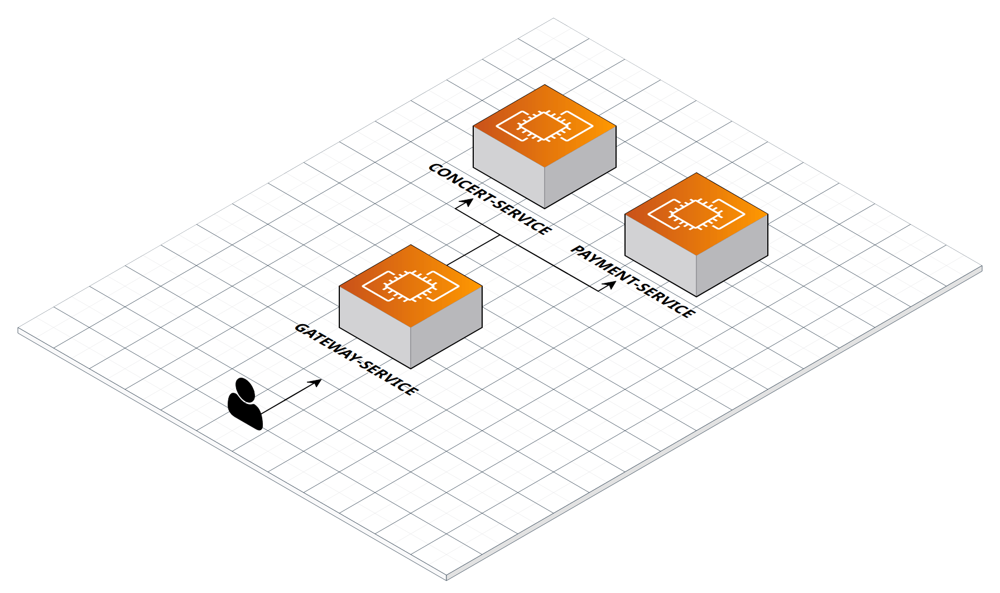

# 대기열 토큰 검증

## 문제 상황

`Monolithic` 환경에서는 대기열 토큰 검증을 `Interceptor`에서 진행했습니다. 
Filter에서 요청에 대한 로깅을 처리하고, `Interceptor`에서 대기열 토큰을 검증한 뒤 각 서비스의 Controller로 API 요청이 전달되었습니다.

하지만 MSA로 전환하면서 작은 단위의 서버로 분리되었고, 동일한 검증 로직을 가진 `Interceptor`를 각 서버마다 구현해야 하는 문제가 발생했습니다.

**각 서버에 Interceptor를 중복 구현할 경우의 문제점**
- 동일한 검증 로직이 여러 서버에 중복 존재
- 검증 로직 변경 시 모든 서버를 수정해야 함
- 토큰 검증 정책의 일관성 유지가 어려움

## 해결 방안: API Gateway 도입

이를 해결하기 위해 각 도메인 서버 앞단에 Gateway 서버를 배치했습니다. 
Gateway 서버가 기존 `Interceptor`의 역할을 대신하여 토큰 검증을 중앙에서 처리합니다.

**Gateway 서버의 책임**
- Active Token에 대한 검증
- API 요청에 대한 공통 처리
- 요청 라우팅

### 토큰 검증 로직 중앙화
```kotlin
/**
 * 대기열 토큰 검증
 *
 * 1. HttpHeader에 대기열 토큰이 존재하는지 검사 -> 없으면 Error
 * 2. 토큰이 ACTIVE_QUEUE에 존재하는지 검사 -> 없으면 Error
 */
override fun apply(config: Config?): GatewayFilter {
    return GatewayFilter { exchange, chain ->
        val request = exchange.request
        val authHeader = request.headers.getFirst(HttpHeaders.AUTHORIZATION)

        if (authHeader.isNullOrEmpty() || !authHeader.startsWith("Bearer ")) {
            return@GatewayFilter writeErrorResponse(
                exchange,
                HttpStatus.UNAUTHORIZED,
                "Authorization 헤더가 없거나 형식이 올바르지 않습니다"
            )
        }

        val token = authHeader.substring(7)
        val validateResult = tokenRepository.validateToken(token)

        if (validateResult == TokenValidationResult.NOT_AVAILABLE) {
            return@GatewayFilter writeErrorResponse(
                exchange,
                HttpStatus.BAD_REQUEST,
                "유효하지 않은 대기열 토큰입니다"
            )
        }

        chain.filter(exchange)
    }
}
```

위 코드로 각 서버에 존재해야 했던 토큰 검증 로직을 `Gateway-Service`에서 중앙화하여 중복 코드를 제거할 수 있었습니다.

### 요청 라우팅 설정

Gateway를 통해 클라이언트 요청을 각 서비스로 라우팅합니다. `application.yml`에 라우팅 정보를 설정하면, 
클라이언트는 Gateway 서버 포트(8000번)로만 요청을 보내도 해당 서비스로 자동 전달됩니다.
```yaml
routes:
  - id: concert-service
    uri: http://localhost:8080
    predicates:
      - Path=/concerts/**
    filters:
      - TokenValidator
```

**라우팅 설정 설명**
- `id`: 라우트 식별자
- `uri`: 실제 서비스 주소
- `predicates`: 요청 경로 매칭 조건
- `filters`: 요청 전처리 필터 (토큰 검증)

이를 통해 클라이언트는 각 서비스의 주소를 알 필요 없이 Gateway 단일 진입점만으로 모든 서비스에 접근할 수 있게 되었습니다.

### SPOF(단일 장애점) 문제

Gateway 도입으로 많은 개선이 있었지만, 인프라 관점에서 Gateway가 단일 장애점(Single Point of Failure)이 되는 문제가 발생했습니다.



기존에는 각 서비스로 직접 요청이 전달되었지만, Gateway 도입 후 모든 요청의 진입점이 Gateway로 집중됩니다.
따라서 Gateway 서버에 장애가 발생하면 후방의 모든 서비스에 장애가 전파될 수 있습니다.

**해결 방안: Gateway 스케일 아웃**

Gateway를 여러 인스턴스로 스케일 아웃하고 앞단에 Load Balancer를 배치하여 SPOF 문제를 해결합니다.
```
[Client]
    ↓
[Load Balancer]
    ↓
┌─────────┬─────────┬─────────┐
│Gateway-1│Gateway-2│Gateway-3│
└─────────┴─────────┴─────────┘
    ↓
[각 마이크로서비스]
```

**스케일 아웃을 통한 효과**
- 장애 격리: 하나의 Gateway 인스턴스가 다운되어도 다른 인스턴스가 요청 처리
- 부하 분산: 트래픽 증가 시 Gateway 인스턴스 추가로 대응
- 무중단 배포: Rolling 배포로 서비스 중단 없이 Gateway 업데이트 가능

## 효과

API Gateway 도입과 스케일 아웃 전략을 통해 토큰 검증 로직을 중앙화하고, 
단일 장애점 문제를 해결하여 안정적인 MSA 환경을 구축할 수 있었습니다.

